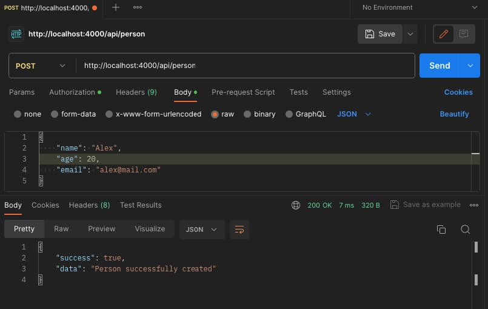

# Node.js TypeScript Project

This is a sample Node.js project using TypeScript. It includes basic configurations for development, building, and running the project.

## Installation

Before running the project, make sure you have Node.js and npm installed. Clone the repository and install the dependencies using the following commands:

```bash
git clone https://github.com/your-username/node-js-typescript-project.git
cd node-js-typescript-project
npm install
```

## start server

```bash
npm run dev
```

This script utilizes nodemon to monitor changes in the source files and restart the server accordingly.


